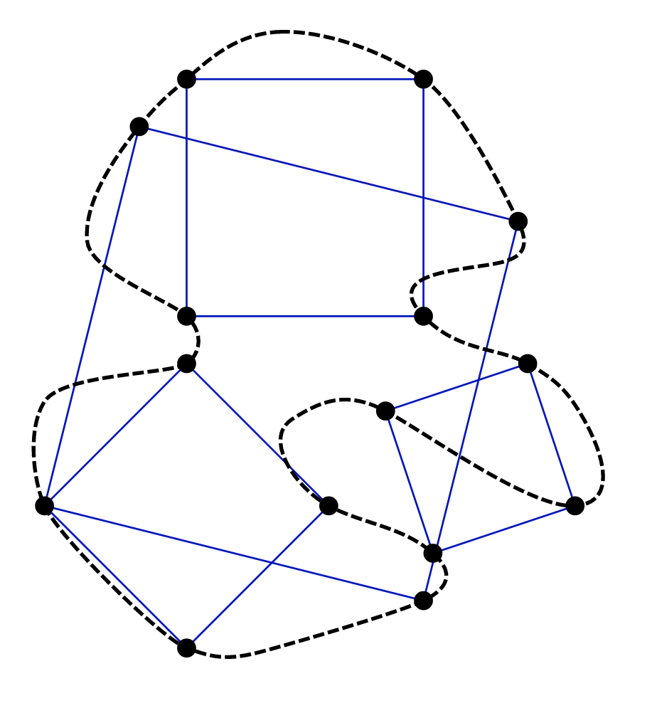
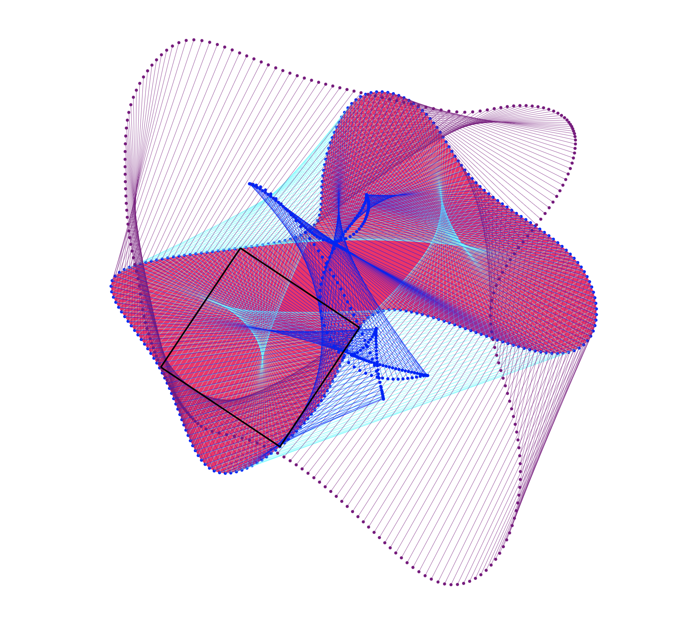

# Inscribed Square Problem (Toeplitz Square Peg)

I find the Inscribed square problem quite interesting, and simply wanted to create a space to explore its bounds through code.
https://en.wikipedia.org/wiki/Inscribed_square_problem
 

## Approach

- Generate paths to follow with svg path
  ** Static
  ** Generative
- Make sample points at even intervals along path, relate all points to one another.
- Generate squares, while treating the lines between path points as the diagonals of the squares.
- Calculate distance from new generated square diagonals to nearest path points and consider the nearest result to be most likely position of square.

## Search for

- Relation of count of inscribed squares in a path to the path characteristics.
- Relation of position of inscribed squares in to path direction and weight at intersect.
- Patterns of paths and constraints of inscribed rectangles and possible inscribed squares along those paths.
